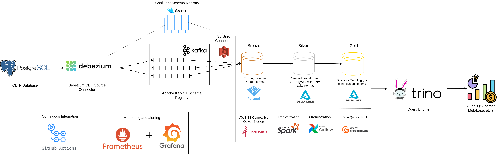

# LakePulse

> A production-grade, fully open-source data lakehouse pipeline implementing modern data engineering patterns

LakePulse is a comprehensive data lakehouse solution that demonstrates real-world data engineering practices using industry-standard technologies. Built for local development and learning, it implements Change Data Capture (CDC) simulation, real-time data processing, and the modern Bronze-Silver-Gold medallion architecture.

**Note: This project is still in development! The documentation here reflects the estimated design.**

## Overview

LakePulse showcases a complete end-to-end data pipeline that:
- **Ingests** data from OLTP databases using simulated CDC
- **Processes** data through multiple layers (Bronze, Silver, Gold) 
- **Stores** data in Delta Lake format for ACID transactions
- **Orchestrates** workflows with Apache Airflow
- **Enables** analytics through SQL interfaces

## Architecture



| Layer | Technology | Purpose |
|-------|------------|---------|
| **Storage** | MinIO | S3-compatible object storage |
| **Data Format** | Delta Lake | ACID transactions, time travel |
| **Processing** | Apache Spark | Distributed data processing |
| **Orchestration** | Apache Airflow | Workflow management |
| **Streaming** | Apache Kafka with Schema Registry (Avro) | Change data capture simulation along with schema evolution |
| **Analytics** | Trino | Distributed SQL query engine |
| **Source DB** | PostgreSQL | OLTP database (Wide World Importers) |
| **Continous Integration** | Github Actions | Interactive data analysis |
| **Monitoring and Alerting** | Prometheus + Grafana | Interactive data analysis |

## Project Structure

```
lakepulse/
├── 📁 airflow/                 # Airflow DAGs and configuration
│   ├── config/                 # Airflow configuration
│   ├── dags/                   # Pipeline definitions
│   └── plugins/                # Airflow plugins
├── 📁 docker/                  # Service configurations
│   ├── postgres/               # Postgres database init
│   ├── airflow/                # Airflow Docker setup
│   ├── spark/                  # Spark Docker setup
│   └── kafka-connect/          # Kafka connect Docker setup
├── 📁 spark_jobs/              # Data processing jobs
│   ├── bronze/                 # Raw data ingestion
│   ├── silver/                 # Data cleaning & validation
│   ├── gold/                   # Business aggregations
│   └── utils/                  # Shared utilities
├── 📁 data/                    # Sample datasets
├── 📁 great_expectations/      # GE project config, expectation suites, checkpoints
├── 📁 trinio/                  # Trino catalog configs (e.g. catalog/delta.properties)
├── 📁 scripts/                 # Utility scripts
├── 🐳 docker-compose.yml       # Multi-service orchestration
├── 📋 Makefile                 # Common commands
└── 📖 README.md                # This file
```

## Learning Objectives

This project demonstrates:

1. **Modern Data Architecture**: Medallion architecture with Bronze-Silver-Gold layers
2. **Real-time Processing**: Kafka-based streaming and CDC patterns  
3. **Data Lake Technologies**: Delta Lake, Parquet, and S3-compatible storage
4. **Workflow Orchestration**: Airflow DAGs for complex data pipelines
5. **Data Quality**: Validation, deduplication, and monitoring techniques
6. **Performance Optimization**: Partitioning, indexing, and query optimization
7. **DevOps Practices**: Containerization, infrastructure as code

---

⭐ **Star this repository if you find it helpful!**
