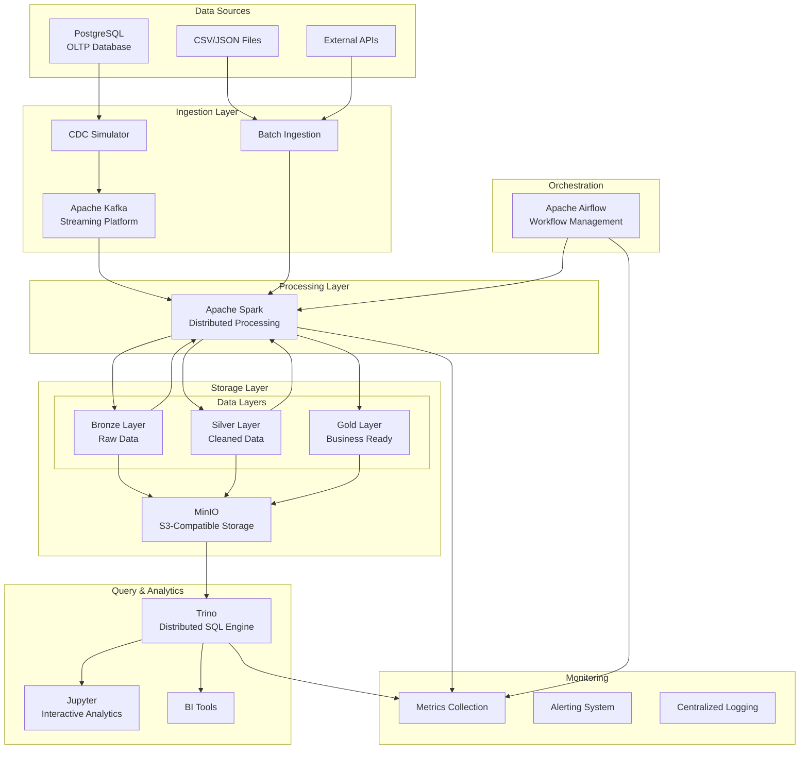

# LakePulse Architecture

> Comprehensive architectural overview of the LakePulse data lakehouse platform

**Note: This project is still in development! The documentation here reflects the estimated design.**

## Architecture Overview

LakePulse implements a modern **medallion architecture** (Bronze-Silver-Gold) combined with **real-time streaming** and **batch processing** capabilities. The platform is designed to be **cloud-native**, **horizontally scalable**, and **production-ready** while remaining **fully local** for development and learning.

## High-Level Architecture



## System Components

### 1. Data Sources Layer

#### PostgreSQL (OLTP Database)
- **Purpose**: Primary transactional database
- **Dataset**: Wide World Importers sample database
- **Tables**: Customers, Orders, Products, Inventory
- **Characteristics**:
  - ~1M+ transactional records
  - Normalized schema (3NF)
  - Real OLTP workload simulation

#### File-based Sources
- **CSV/JSON Files**: Historical data imports
- **External APIs**: Third-party data integration
- **Manual Uploads**: Ad-hoc data analysis

### 2. Ingestion Layer

#### Change Data Capture (CDC) Simulation
```json
// CDC Event Structure
{
  "before": {
    "id": 1,
    "name": "Alice",
    "email": "alice@example.com"
  },
  "after": {
    "id": 1,
    "name": "Alice Smith",
    "email": "alice.smith@example.com"
  },
  "source": {
    "version": "2.4.1.Final",
    "connector": "postgresql",
    "name": "dbserver1",
    "ts_ms": 1723059919230,
    "snapshot": "false",
    "db": "users_db",
    "schema": "public",
    "table": "users",
    "txId": 4785,
    "lsn": 24152160,
    ...
  },
  "op": "u",  // Operation: c (create), u (update), d (delete), r (read snapshot)
  "ts_ms": 1723059919232,  // Timestamp of event
  "transaction": {
    "id": "abcd-1234",
    "total_order": 2,
    "data_collection_order": 1
  }
}
```

**Features**:
- Real-time change simulation
- Configurable event frequency
- Multiple change patterns (bulk, trickle, burst)
- Schema evolution handling

#### Apache Kafka
- **Topics Structure**:
  ```
  lakepulse.cdc.customers
  lakepulse.cdc.orders
  lakepulse.cdc.products
  lakepulse.cdc.inventory
  ```
- **Partitioning**: By customer_id for ordered processing
- **Retention**: 7 days for replay capability
- **Serialization**: Avro with Schema Registry

### 3. Processing Layer (Apache Spark)

#### Spark Cluster Configuration
```yaml
Spark Master:
  - Cores: 2
  - Memory: 2GB
  - Role: Cluster coordination

Spark Workers (1x - my laptop cannot handle 2+):
  - Cores: 2 each
  - Memory: 4GB each
  - Role: Task execution
```

#### Processing Patterns

**Structured Streaming** (Consume Kafka CDC in near realtime. Currently I'm having performance issues with this):
```python
# Kafka to Bronze streaming
stream = spark.readStream \
    .format("kafka") \
    .option("kafka.bootstrap.servers", "kafka:9092") \
    .option("subscribe", "lakepulse.cdc.*") \
    .load()

stream.writeStream \
    .format("delta") \
    .outputMode("append") \
    .option("checkpointLocation", "/checkpoints/bronze") \
    .table("bronze.raw_events")
```

**Batch Processing** (Scheduled):
```python
# Silver layer transformation
df = spark.read.format("delta").table("bronze.customers")
cleaned_df = clean_and_validate(df)
cleaned_df.write.format("delta").mode("overwrite").table("silver.customers")
```

### 4. Storage Layer (MinIO + Delta Lake)

#### Object Storage Structure
```
lakepulse-bronze/
├── customers/
│   ├── year=2024/month=07/day=25/
│   │   ├── part-001.snappy.parquet
├── orders/
└── products/

lakepulse-silver/
├── customers/
│   ├── year=2024/month=07/
│   │   ├── part-001.snappy.parquet
│   │   └── _delta_log/

lakepulse-gold/
├── customer_analytics/
├── sales_metrics/
└── operational_reports/
```

#### Delta Lake Features
- **ACID Transactions**: Guaranteed consistency
- **Time Travel**: Historical data access
- **Schema Evolution**: Automatic schema handling
- **Upserts**: Efficient change handling
- **Optimization**: Z-ordering and compaction

### 5. Orchestration Layer (Apache Airflow)

#### DAG Structure
```python
# Example: End-to-end pipeline DAG
with DAG('lakepulse_daily_pipeline') as dag:
    
    # Data quality checks
    check_source_data = BashOperator(
        task_id='check_source_data',
        bash_command='make verify-data'
    )
    
    # Bronze layer processing
    bronze_ingestion = SparkSubmitOperator(
        task_id='bronze_ingestion',
        application='/opt/spark/jobs/bronze_ingestion.py'
    )
    
    # Silver layer processing
    silver_transformation = SparkSubmitOperator(
        task_id='silver_transformation',
        application='/opt/spark/jobs/silver_transformation.py'
    )
    
    # Gold layer aggregation
    gold_aggregation = SparkSubmitOperator(
        task_id='gold_aggregation',
        application='/opt/spark/jobs/gold_aggregation.py'
    )
    
    # Data quality validation
    quality_check = PythonOperator(
        task_id='quality_check',
        python_callable=run_quality_checks
    )
    
    check_source_data >> bronze_ingestion >> silver_transformation >> gold_aggregation >> quality_check
```

### 6. Query & Analytics Layer

#### Trino Configuration
```yaml
Catalogs:
  - delta: Delta Lake tables via MinIO
  - postgres: Source database queries
  - memory: Temporary query processing

Query Engine Features:
  - Cross-catalog joins
  - Predicate pushdown
  - Vectorized execution
  - Intelligent caching
```

#### Jupyter Integration
- **Kernels**: Python, SQL, Scala
- **Connectors**: Trino, Spark, PostgreSQL
- **Visualization**: Matplotlib, Plotly, Bokeh
- **ML Libraries**: Scikit-learn, pandas, NumPy

### 7. Monitoring & Observability

#### Metrics Collection
```yaml
System Metrics:
  - CPU, Memory, Disk usage
  - Network I/O
  - Container health

Application Metrics:
  - Processing latency
  - Record throughput
  - Error rates
  - Data quality scores

Business Metrics:
  - Pipeline SLA compliance
  - Data freshness
  - Cost per GB processed
```

## 🎯 Data Flow Architecture

### 1. Bronze Layer (Raw Data Ingestion)

**Objective**: Capture all source data with minimal transformation

**Process Flow**:
1. **CDC Events** → Kafka topics
2. **Structured Streaming** → Read from Kafka
3. **Raw Storage** → Write to Delta Lake (Bronze)
4. **Metadata Capture** → Track lineage and quality

**Data Characteristics**:
- **Format**: Delta Lake (Parquet + transaction log)
- **Partitioning**: By date and source table
- **Schema**: Source schema + metadata columns
- **Retention**: 30 days (configurable)

**Quality Controls**:
- Schema validation
- Duplicate detection
- Basic format checks
- Completeness metrics

### 2. Silver Layer (Cleaned & Validated)

**Objective**: Clean, validate, and standardize data

**Process Flow**:
1. **Read Bronze** → Delta Lake tables
2. **Data Cleaning** → Remove duplicates, fix formats
3. **Validation** → Apply business rules
4. **Enrichment** → Add derived columns
5. **Write Silver** → Validated Delta Lake tables

**Transformations**:
```python
# Example transformations
def clean_customer_data(df):
    return df \
        .dropDuplicates(['customer_id']) \
        .withColumn('email', lower(col('email'))) \
        .withColumn('phone', regexp_replace(col('phone'), '[^0-9]', '')) \
        .withColumn('created_date', to_timestamp(col('created_date'))) \
        .filter(col('customer_id').isNotNull())
```

**Quality Controls**:
- Referential integrity checks
- Business rule validation
- Data profiling
- Anomaly detection

### 3. Gold Layer (Business-Ready Analytics)

**Objective**: Create optimized, business-focused datasets using Kimball Modeling

**Process Flow**:
1. **Read Silver** → Validated data
2. **Aggregation** → Business metrics calculation
3. **Optimization** → Partitioning and indexing
4. **Write Gold** → Analytics-ready tables

**Business Entities**:
```sql
-- Sales Metrics
CREATE TABLE gold.fact_sales AS
SELECT 
    order_date,
    region,
    product_category,
    total_orders,
    total_revenue,
    avg_order_value,
    unique_customers
FROM silver.orders
GROUP BY order_date, region, product_category;
```


## DevOps & Infrastructure

### Container Orchestration
```yaml
# docker-compose.yml structure
services:
  postgres:          # Source database
  minio:             # Object storage
  kafka:             # Streaming platform
  kafka-connector:   # Moving data into and out of Kafka 
  schema-registry:   # Managing and storing schemas
  kafka-ui:          # Kafka WebUI
  spark-master:      # Spark cluster head
  spark-worker:      # Spark executor
  airflow:           # Airflow Standalone
  trino:             # Query engine
  prometheus:        # Monitoring: Metrics collection
  grafana:           # Monitoring: Visualization
```

### Monitoring Stack
```yaml
Monitoring Components:
  - Prometheus: Metrics collection
  - Grafana: Visualization
```

### CI/CD Pipeline
```yaml
Pipeline Stages:
  1. Code Quality: Linting, formatting
  2. Unit Tests: Component testing
  3. Integration Tests: Service interaction
  4. Build: Container image creation
  5. Deploy: Environment deployment
  6. E2E Tests: Full pipeline validation
  7. Performance Tests: Load testing
```

## Design Principles

### 1. **Modularity**
- Loosely coupled components
- Clear interfaces between services
- Independent scaling and deployment

### 2. **Reliability**
- Fault tolerance at every layer
- Graceful degradation
- Circuit breaker patterns

### 3. **Observability**
- Comprehensive logging
- Detailed metrics
- Distributed tracing
- Real-time monitoring

### 4. **Performance**
- Efficient data formats
- Smart partitioning
- Query optimization
- Resource management

### 5. **Security**
- Defense in depth
- Principle of least privilege
- Data encryption
- Audit trails

### 6. **Maintainability**
- Clear documentation
- Standardized patterns
- Automated testing
- Code quality gates

---

This architecture provides a solid foundation for modern data engineering practices while maintaining simplicity for learning and development. The design emphasizes scalability, reliability, and maintainability while showcasing industry-standard technologies and patterns.
